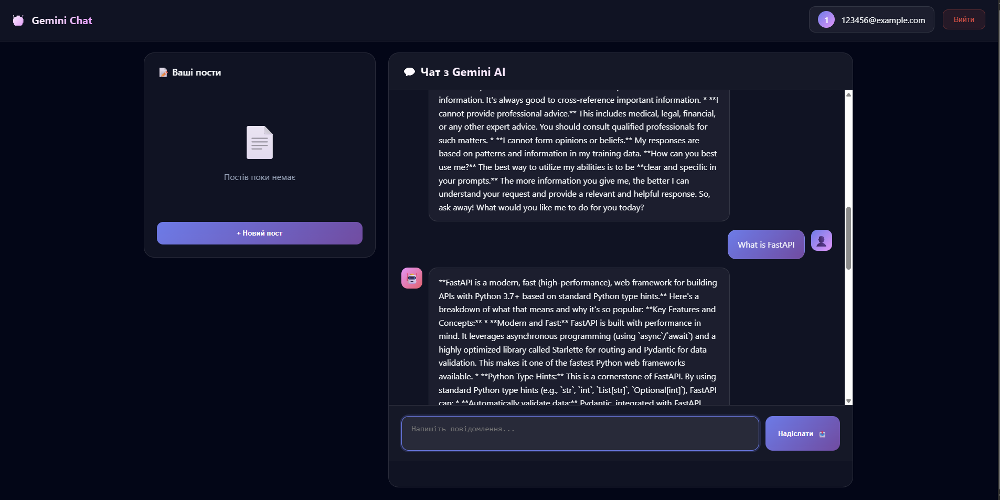
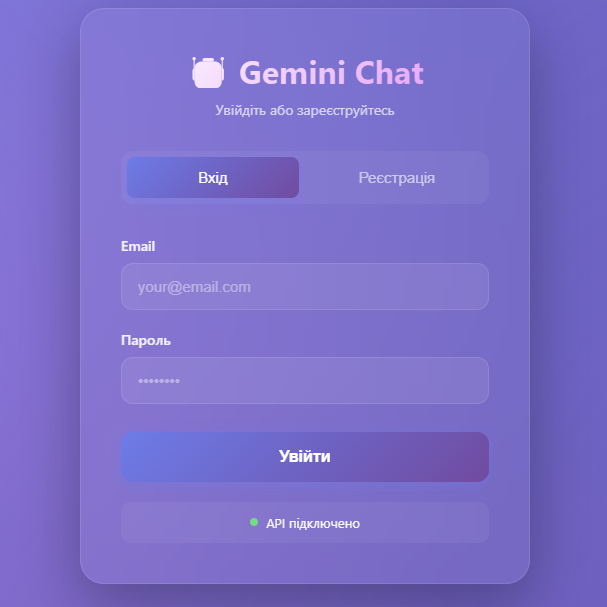
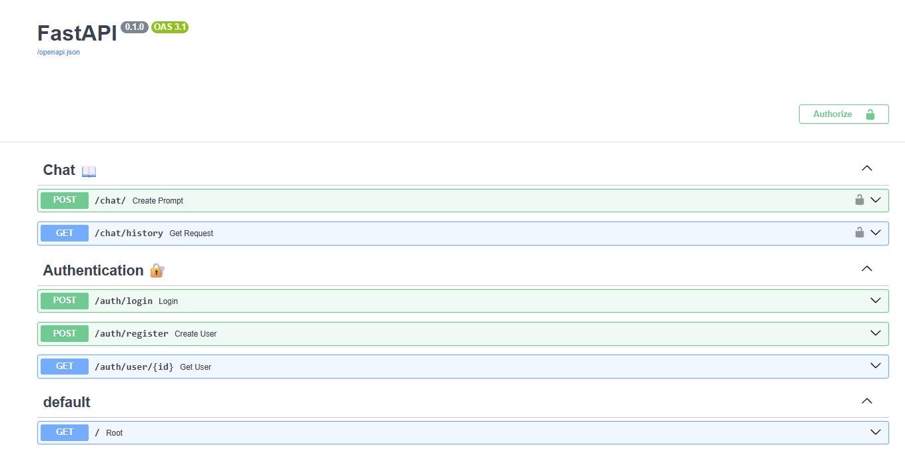

  
<div align="center">
<h1 align="center">🚀 FastAPI + Google Gemini AI Integration</h1>
  


**AI-Powered Content Generation Platform with Full-Stack Authentication**
</div>

---

## ✨ Features

🤖 **AI Content Generation** - Leverage Google Gemini AI to create intelligent, context-aware posts  
🔐 **Secure Authentication** - JWT-based authentication system with user registration and login
💾 **PostgreSQL Database** - Robust data persistence with SQLAlchemy ORM  
🐳 **Docker Ready** - Complete containerization for seamless deployment  
🎨 **Modern Frontend** - Interactive web interface with real-time AI chat  
🧪 **Testing Suite** - Comprehensive pytest integration for reliability  
📊 **Logging & Monitoring** - Built-in request logging and performance tracking

---

## 🎥 Demo

### 💬 AI Chat Interface



*Interactive chat with Google Gemini AI for content generation*

### 🔑 Authentication System



*Secure user authentication with JWT tokens*

### 📱 Swagger



---

## 🛠️ Tech Stack

| Category | Technologies |
|----------|-------------|
| **Backend** | FastAPI, Python 3.9+ |
| **Database** | PostgreSQL, SQLAlchemy, Alembic |
| **AI/ML** | Google Gemini API |
| **Authentication** | JWT, OAuth2, Passlib |
| **Frontend** | HTML5, CSS3, JavaScript |
| **DevOps** | Docker, Docker Compose |
| **Testing** | Pytest |

---

## 🚀 Quick Start

### Prerequisites

- 🐍 Python 3.9 or higher
- 🐳 Docker & Docker Compose
- 🔑 Google Gemini API Key ([Get one here](https://ai.google.dev/))

### Installation

1️⃣ **Clone the repository**

```bash
git clone https://github.com/IvanShepeta/FastApi_Gemini.git
cd FastApi_Gemini
```
2️⃣ **Configure environment variables**
```bash

# Gemini API
GEMINI_API_KEY=your_api_key

# Postgres
DATABASE_HOSTNAME = localhost
DATABASE_PORT = 5432
DATABASE_PASSWORD = passward_that_you_set
DATABASE_NAME = name_of_database
DATABASE_USERNAME = User_name
SECRET_KEY = 09d25e094faa2556c818166b7a99f6f0f4c3b88e8d3e7 
ALGORITHM = HS256
ACCESS_TOKEN_EXPIRE_MINUTES = 30

```

## 📁 Project Structure

```bash
FastApi_Gemini/
├── 📂 app/
│ ├── 📂 routers/
│ │ ├── auth.py # Authentication endpoints
│ │ └── post.py # Post CRUD operations
│ ├── config.py # Application configuration
│ ├── database.py # Database connection & session
│ ├── gemini_client.py # Google Gemini API client
│ ├── main.py # FastAPI application entry point
│ ├── models.py # SQLAlchemy database models
│ ├── oauth2.py # JWT authentication logic
│ ├── schemas.py # Pydantic validation schemas
│ └── utils.py # Utility functions
├── 📂 alembic/ # Database migrations
├── 📂 frontend/
│ ├── index.html # Main dashboard
│ └── chat.html # AI chat interface
├── 📂 tests/ # Test suite
├── 🐳 Dockerfile # Container configuration
├── 🐳 docker-compose.yml # Multi-container setup
├── 📋 requirements.txt # Python dependencies
└── ⚙️ alembic.ini # Alembic configuration
```
